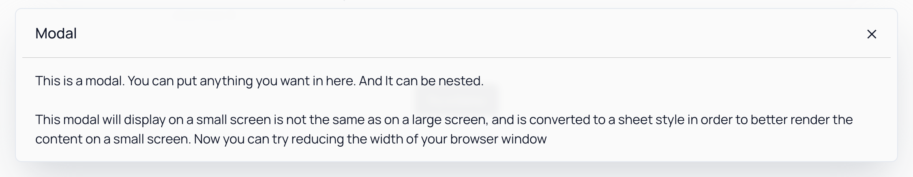
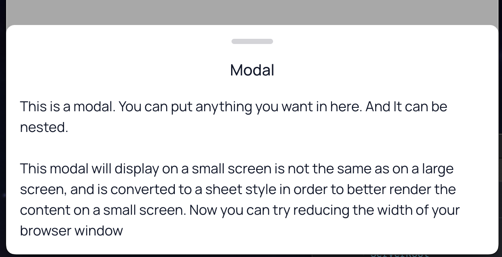

# rc-modal

Beautifully designed Modal Component built with Radix UI and Tailwind CSS.

| Modal                        | Sheet                        |
| ---------------------------- | ---------------------------- |
|  |  |

...and it's fully responsive!

## For more details..

Please visit the [documentation](https://rc-modal.pages.dev/install).

## Inspiration

This component is ported from [Shiro](https://github.com/Innei/Shiro).

## License

2024 © Innei, Released under the MIT License. This project is based on [innei-template/rc-library-template)](https://github.com/innei-template/rc-library-template).

> [Personal Website](https://innei.ren/) · GitHub [@Innei](https://github.com/innei/)